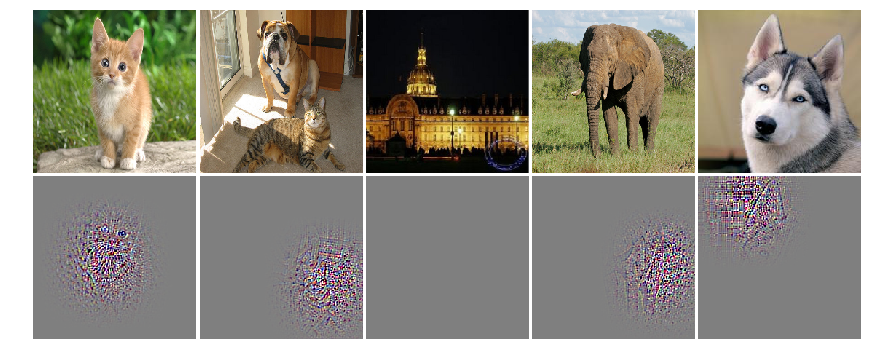

# DeConvnet
Deconvolutional neural network for visualizing CNN

construct Deconvolutional neural network using DeConvolution(Conv2DTranspose) and DePooling(with switch)

## result

## Reference
[1] [Visualizing and Understanding Convolutional Network, 2014](https://arxiv.org/pdf/1311.2901.pdf)  
[2] [https://github.com/jalused/Deconvnet-keras](https://github.com/jalused/Deconvnet-keras)  
<!-- [5]    -->